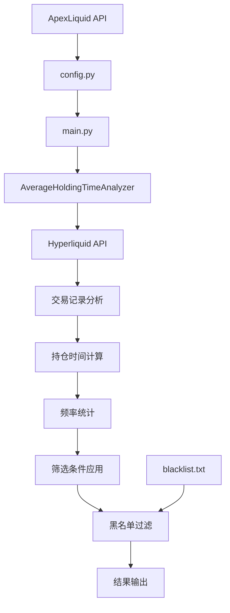
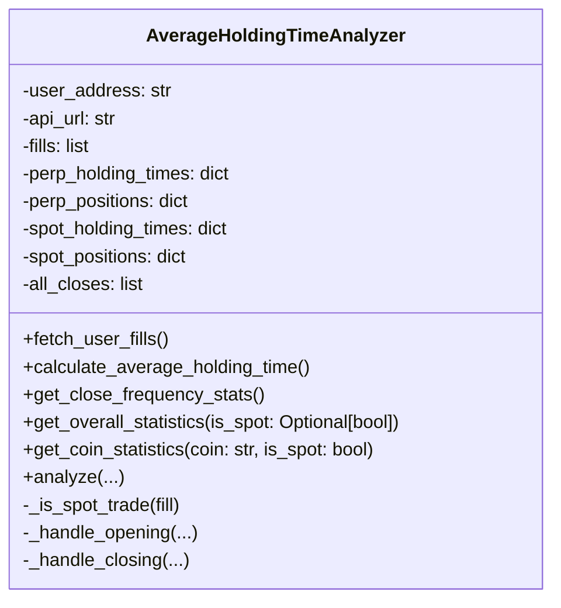

# 项目架构文档

## 整体架构

本项目采用模块化设计，主要包含数据获取、数据分析、筛选逻辑和结果输出四个核心模块。

```
┌─────────────────┐    ┌─────────────────┐    ┌─────────────────┐    ┌─────────────────┐
│   ApexLiquid    │    │  Hyperliquid    │    │   分析引擎      │    │   筛选结果      │
│   数据源        │───▶│   API 接口      │───▶│                │───▶│                │
│                 │    │                 │    │                │    │                │
└─────────────────┘    └─────────────────┘    └─────────────────┘    └─────────────────┘
```

## 核心模块

### 1. 数据获取模块

#### ApexLiquid 数据源
- **功能**: 获取符合条件的交易者地址列表
- **接口**: `https://apexliquid.bot/v1/web/top_trades`
- **筛选条件**:
  - 最少交易天数: 10天
  - 最小收益率: 5%
  - 最大回撤: 80%
- **数据格式**: JSON，包含交易者地址和基本信息

#### Hyperliquid API
- **功能**: 获取详细的交易记录
- **接口**: `https://api.hyperliquid.xyz/info`
- **请求类型**: POST
- **返回数据**: 用户的所有交易记录（fills）

### 2. 数据分析模块

#### AverageHoldingTimeAnalyzer 类
主要的分析器类，负责以下功能：

##### 数据获取
```python
def fetch_user_fills(self):
    """获取用户的成交记录"""
```

##### 交易类型识别
```python
def _is_spot_trade(self, fill):
    """判断是否为现货交易"""
```

##### 持仓时间计算
```python
def calculate_average_holding_time(self):
    """计算平均持仓时间"""
```

##### 频率统计
频率统计通过在平仓处理时累积 `all_closes`，随后由以下方法聚合：

```python
def get_close_frequency_stats(self):
    """获取平仓频率统计（最近24h、总体日均）"""
```

### 3. 筛选逻辑模块

#### 核心筛选条件
1. **最近24小时平仓数** ≥ 24次
2. **平均每天平仓数** ≥ 24次
3. **排除黑名单地址**

#### 筛选流程
```
获取交易记录 → 识别交易类型 → 计算持仓时间 → 统计交易频率 → 应用筛选条件 → 输出结果
```

### 4. 配置管理模块

#### config.py
- **功能**: 存储 ApexLiquid 获取的交易者数据
- **格式**: JSON 字符串格式的 address_list

#### blacklist.txt
- **功能**: 存储需要排除的地址列表
- **格式**: 每行一个地址

## 数据流图



## 类结构图



## 关键算法

### 1. 交易类型识别算法
```python
def _is_spot_trade(self, fill):
    # 现货：dir 为 Buy/Sell；合约：dir 中包含 Open/Close
    direction = fill['dir']
    return direction in ['Buy', 'Sell']
```

### 2. 持仓时间计算与 FIFO 平仓匹配
在 `_handle_opening` 与 `_handle_closing` 中以 FIFO 匹配开/平仓并累积 `holding_time_hours`。

### 3. 频率与综合条件
`get_close_frequency_stats` 统计最近24h平仓数与总体日均平仓数；`meets_criteria` 综合校验：
- 最近24小时平仓数 ≥ 阈值
- 平均每天平仓数 ≥ 阈值
- 总体平均持仓时间 ≤ 1 小时

## 性能考虑

### 1. API 调用优化
- 批量处理多个地址
- 添加请求间隔避免频率限制
- 错误重试机制

### 2. 数据处理优化
- 使用 defaultdict 提高字典操作效率
- 时间计算使用 datetime 对象
- 避免重复计算

### 3. 内存管理
- 及时清理不需要的数据
- 使用生成器处理大量数据
- 分批处理避免内存溢出

## 扩展性设计

### 1. 插件化架构
- 分析器类可以独立扩展
- 支持添加新的筛选条件
- 支持集成其他数据源

### 2. 配置化
- 筛选参数可配置
- API 地址可配置
- 输出格式可配置

### 3. 模块化
- 每个功能模块独立
- 便于测试和维护
- 支持单元测试

## 错误处理

### 1. API 调用错误
- 网络超时处理
- HTTP 错误状态码处理
- JSON 解析错误处理

### 2. 数据异常
- 空数据处理
- 数据格式错误处理
- 时间戳异常处理

### 3. 系统异常
- 文件读写错误
- 内存不足处理
- 并发访问控制

## 安全考虑

### 1. 数据安全
- 敏感信息不记录日志
- API 密钥安全存储
- 数据传输加密

### 2. 访问控制
- API 调用频率限制
- 黑名单机制
- 输入验证

### 3. 隐私保护
- 不存储用户敏感信息
- 数据匿名化处理
- 符合隐私法规要求
